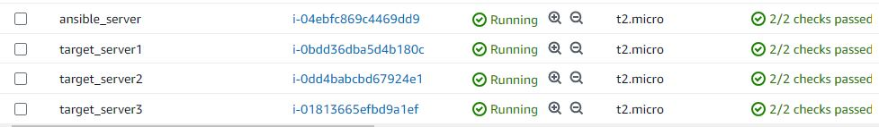
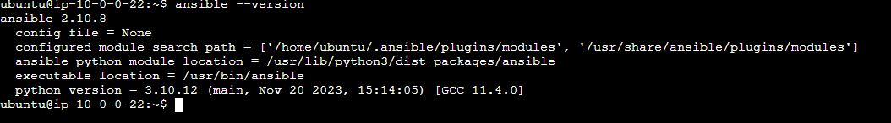
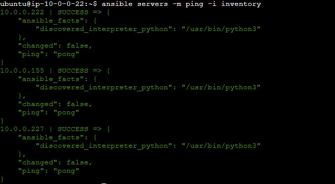
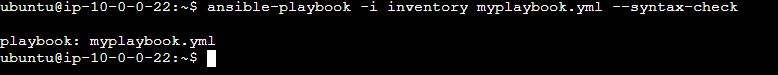

# Automating the Deployment of web application on multiple EC2 servers using Ansible

Ansible is an open-source automation tool, or platform, used for IT tasks such as configuration management, application deployment, intraservice orchestration, and provisioning.
In this project we will be using ansible to automate application deployment on our EC2 servers.

## Local Setup
We are going to be using Vscode as our code editor
We are going to deploy 4 EC2 instances running ubuntu distribution on our AWS management console
One of the instance is going to be confgiured as our ansible server while the other 3 are going to be configured as our target server like so

### Install ansible
We are going to configure one of our ec2 instance as the ansible server.
Use below command to install ansible
sudo apt update
sudo apt install ansible
We need to verify ansible has been installed on our ansible server; use below command
ansible –-version

### Configure Passwordless authentication on our target server
Ansible needs passwordless authentication to be able to seamlessly run our planybooks on the target server
To configure passwordless authentication, we are going to be making use of ssh-keygen

Follow below steps to configure passwordless authentication;
Connect to our ansible server on the AWS console using EC2 instance connect; Our ansible server is running an ubuntu distribution
Then run below comamnds
ssh-keygen; used to generate our key pair
cat /home/ubuntu/.ssh/id_rsa.pub; used to display the content of our public key. Copy the public key

Connect to our target servers on the AWS console using EC2 instance connect; Our target servers is running an ubuntu distribution
We are going to be configuring 3 target servers.
Then run below commands
ssh-keygen;  used to generate our key pair
nano cd /home/ubuntu/.ssh/authorized_keys
Then paste the public key of the ansible server and save

Our ansible server has now been successfully configured for passwordless authentication.

### Testing connectivity between our ansible server and our target server
Run below ansible adhoc command on the ansible server
ansible servers -m ping -i inventory

## Write ansible playbook
Finally it is time to write our playbook

Clone my application directory, myplaybook.yml and my inventory file
Replace the webserver IP addresses with the IP of your target servers
Check our playbook for syntax errors using below command
ansible-playbook -i inventory myplaybook.yml --syntax-check

Then run below command to deploy our application across our target servers

